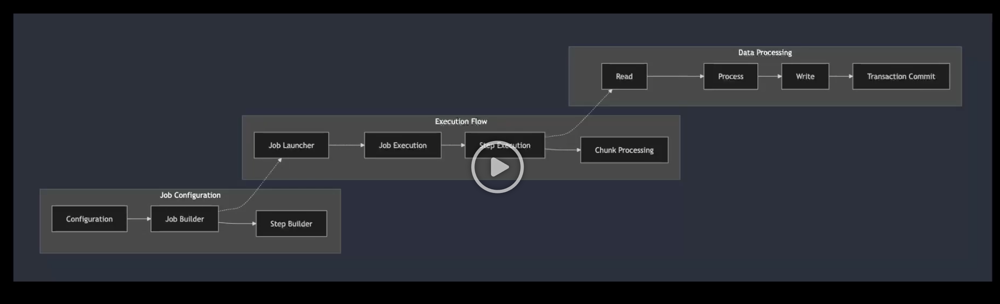

# 배치 처리

- 대량의 데이터를 주기 OR 조건에 따라 일괄 처리 한다

> 실시간 처리처럼 빠른 응답이 아니라, 안정성과 대량 처리가 중요하다.

데이터 처리(파일 / 데이터베이스 / Kafka / Redis) / 트랜잭션 관리 / 체크포인트 / 에러 -재시도

# Spring Batch 구조

### JOB Launcher

- Job 실행 인터페이스 (외부 이벤트 or 스케줄러에 의해 실행)

### JOB

- 배치 처리 기본 단위 (여러 Stop을 Job으로 묶는다)
- Job Repository에 각 실행단위로 저장해서 상태를 관리한다.

### Stop

- Job 내부 세부 작업 단위

처리 단위

1. Chunk 기반 처리 : 대량 데이터를 작은 데이터로 나눠 일괄 처리
2. Tasklet : 하나의 단일 작업을 처리

### Job Repository

1. Stop의 실행 상태 & 메타데이터 관리
2. Job 성공/실패 여부 , STEP 실행 상태 , 오류 발생 시점
3. Job 에러 발생 시 이전 상태로 복구

### Job Configuration

1. XML / JAVA 설정(DI) 으로 JOB,STOP 정의

# Spring Batch의 순서

1. READ : 데이터 소스에서 읽기
2. PROCESS : 데이터 처리
3. WRITE : 데이터 저장소에 쓰기

- [CHUNK 기반 데이터 처리] : CHUNK단위로 READ PROCESS WRITE COMMIT
  

# 알아두면 좋은것들

- Cron 표현식을 통해 주기 / Quartz 스케줄러 / 젠킨스와 통합 (Jenkins Job을 통한 Batch 실행)
