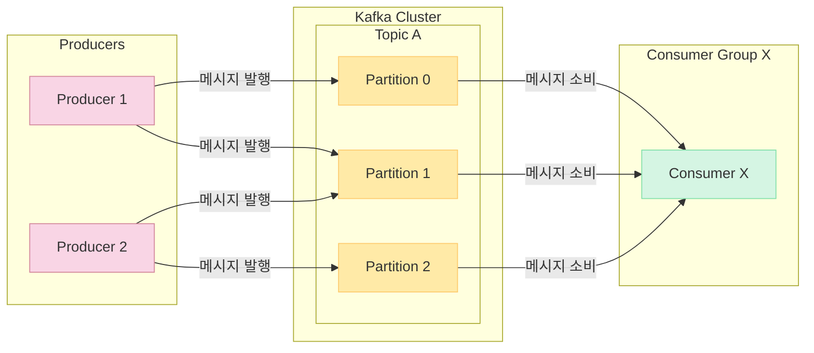
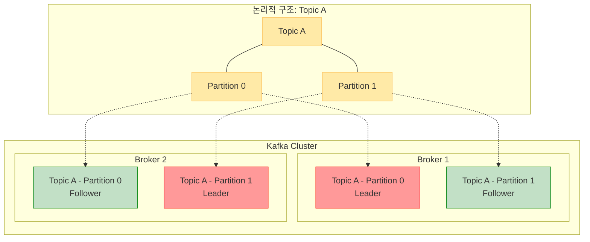

대규모 실시간 데이터 스트리밍 및 로그 수집에 최적화된 메세지 큐 서비스

확장성(수평 확장) / 내구성(Replication)/ 높은 처리량( 배치처리 / 압축 )

Producer는 Topic에 메시지를 발행, Topic은 이를 저장하며 Consumer는 Topic으로부터 메시지를 소비한다.

Kafka는 Cluster를 이루며, 하나의 노드를 Broker라 부른다.
Partition은 Topic의 물리적인 구현체이자,데이터를 담고있기 때문에 Partition 별로 Replication을 적용하고, Leader가 Partition의 동작을 수행하고 Follower가 Failover를 담당하여 Active Standby형태 구조를 띈다 

Kafka는 Offset을 통해 Consumer가 읽은 위치를 기억한다.
    Exactly-Once 처리 가능