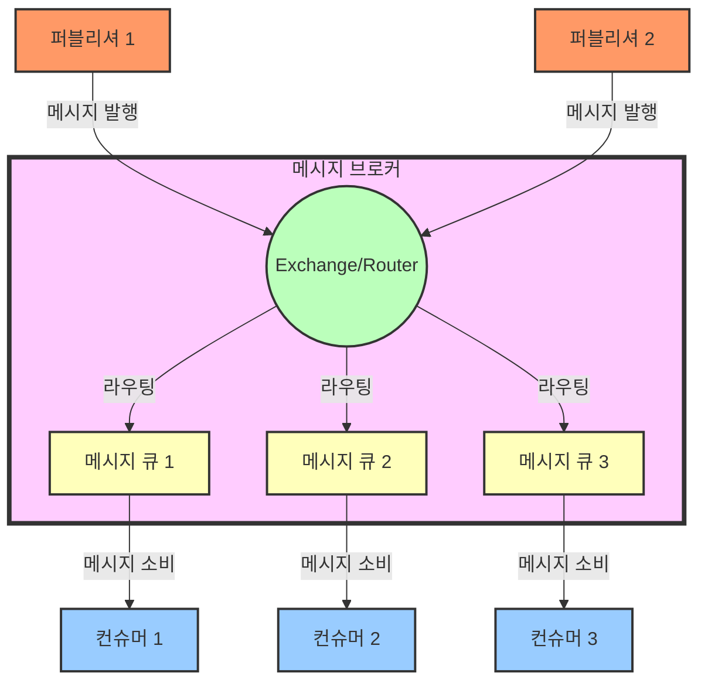
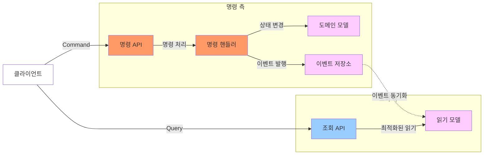
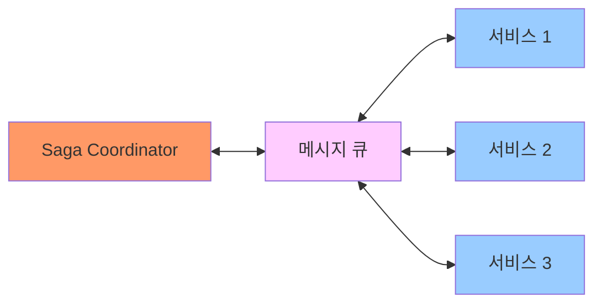

# 병렬성

> 멀티 코어에서 여러 작업이 동시에 처리되는것

```mermaid
gantt
    title 병렬성 vs 동시성
    dateFormat  s
    axisFormat %S

    section 병렬성
    CPU 코어 1 - 작업 A : a1, 0, 4s
    CPU 코어 2 - 작업 B : a2, 0, 4s
    CPU 코어 3 - 작업 C : a3, 0, 4s
    CPU 코어 4 - 작업 D : a4, 0, 4s
```

# 동시성

> 싱글 코어에서 여러 스레드를 번갈아가며 빠르게 실행하며 마치 동시에 실행되는것 처럼 보이게 만드는 방식

ex : Node JS(비동기 IO + Event Loop), Event Driven 시스템

장점 : 자원 효율적으로 사용, 동시 처리로 인해 대기 시간 줄임
단점 : 스레드 관리(DeadLock / Race Condition), 동기화 문제(동시 접근 시 데이터 손상)

```mermaid
gantt
    title 병렬성 vs 동시성
    dateFormat  s
    axisFormat %S

    section 동시성
    CPU 코어 1 - 작업 A : crit, c1, 0, 1s
    CPU 코어 1 - 작업 B : crit, c2, 1, 1s
    CPU 코어 1 - 작업 C : crit, c3, 2, 1s
    CPU 코어 1 - 작업 D : crit, c4, 3, 1s

```

# 비동기 처리

> 작업 완료를 기다리지 않고 다른 작업 진행 하다가 Callback이나 Event를 받아 추가 작업을 진행한다.

ex : 네트워크 요청 / 파일 다운로드 , UI

장점 : 병목 현상 완화 (성능 개선)
단점 : 코드 복잡성 증가, Exception 즉시 감지 어려움

```mermaid
gantt
    title 동기 처리 vs 비동기 처리 (시간 관점)
    dateFormat s
    axisFormat %S

    section 동기 처리
    요청 A       : a1, 0, 2s
    요청 B       : a2, after a1, 3s
    요청 C       : a3, after a2, 2s
    총 소요 시간 : milestone, m1, after a3, 0s

    section 비동기 처리
    요청 A       : active, b1, 0, 2s
    요청 B       : done, b2, 0, 3s
    요청 C       : crit, b3, 0, 2s
    다른 작업 수행: b4, 0, 3s
    총 소요 시간 : milestone, m2, 3, 0s
```

### 단일 프로세스에서 비동기 처리

Event Loop / Thread Pool을 이용해서 IO작업을 비동기로 처리한다.

##### Event Loop

Queue로 저장하고, 꺼내서 작업하는 방법( Completable / Non-blocking )

> 하나의 스레드가 여러 작업을 순차적으로 처리하는 방식
> 단일 스레드 기반 동작, 비동기 작업 완료 시 이벤트 큐에 있는 작업 처리

사용 : 입출력 작업에 특화 (Non Blocking I/O를 통해 다음 작업을 진행)

구현 방법 : CallBack Pattern / CompletableFuture-exceptionally-thenAccept

주의점 :

1. Thread Safety(Synchronized)를 고려해야한다.
2. 문제 발생 시, 예외 처리 필요

##### Thread Pool

> 미리 생성된 스레드의 집합으로, 요청시 신규 생성이 아닌 만들어둔 스레드를 재사용 한다.

##### 스레드 풀 사용 시 고려할 점

- 스레드 풀의 크기

Context Switching 비용증가

- 작업의 종류

  CPU집약적인 작업 - CPU 코어와 맞춘다.
  IO 집약적 작업 - 많은 쓰레드 생성

- 스레드 생성 & 파괴 비용

Default Thread / Max Thread / 유휴 시간을 고려하여 최적화

- 메모리 사용량

스레드당 Stack Memory 별도 > 자원 할당량 증가

- 동기화 문제

Lock 경쟁 최소화 -> Lock Free 알고리즘 도입

- 응답 시간, 처리량

빠른 응답시간 : Thread 수 증가 하여 빠르게 응답하도록 설계

### 대규모 환경 비동기 처리 : 비동기 메시징 시스템

독립성, 확장성, 성능향상을 보장한다.

### Event Driven Architecture

서비스간 느슨한결합과 실시간 반응성을 제공하는 비동기 메시징 시스템

상태변화를 이벤트로 처리, 각 서비스는 이벤트에 비동기적으로 반응한다.

트래픽 폭주 시 제어할 수 있는 수단으로 사용 가능, 서비스가 독립적으로 동작하여 느슨한 결합을 구성한다.

##### Message Broker

Publish / Consumer 패턴 기반으로 여러 서비스가 구독하고 특정 이벤트 발생 시 비동기적으로 구독자에게 전달

1. 메시지를 큐에 저장하여 안정적 전달
2. 트래픽 분산 시스템 과부하 방지
3. 서비스간 느슨한 결합 가능

##### Message Queue

소비자가 준비되면 메시지를 비동기적으로 처리

1. Producer : 메시지 생성하여 큐에 넣는 주체
2. Queue : 메시지 일시적 저장 공간
3. Consumer : 큐에서 메시지 가져가 처리하는 주체

###### 메시지 큐와 메시지 브로커 비교

| 특성            | 메시지 큐 (Message Queue)                                         | 메시지 브로커 (Message Broker)                                    |
| --------------- | ----------------------------------------------------------------- | ----------------------------------------------------------------- |
| **정의**        | 메시지를 저장하고 전달하는 데이터 구조                            | 메시지 큐를 포함한 메시징 시스템의 중앙 관리 컴포넌트             |
| **역할**        | 메시지를 임시 저장하고 FIFO(First In, First Out) 원칙에 따라 전달 | 메시지 라우팅, 변환, 저장 및 전달을 관리하는 중재자 역할          |
| **기능 범위**   | 메시지 순서 보장과 버퍼링에 초점                                  | 메시지 라우팅, 변환, 프로토콜 변환, 토픽 관리 등 다양한 기능 제공 |
| **구조적 위치** | 메시지 브로커 내부의 구성 요소로 존재                             | 전체 메시징 인프라를 관리하는 상위 시스템                         |
| **예시**        | RabbitMQ, Amazon SQS                                              | RabbitMQ, Apache Kafka,                                           |
| **통신 패턴**   | 주로 점-대-점(Point-to-Point) 통신 지원                           | 점-대-점 및 발행-구독(Pub-Sub) 패턴 모두 지원                     |
| **라우팅 능력** | 제한적이거나 없음                                                 | 다양한 라우팅 전략과 패턴 지원 (토픽 기반, 콘텐츠 기반 등)        |
| **메시지 유지** | 일반적으로 소비될 때까지만 메시지 유지                            | 설정에 따라 영구 저장 및 다양한 보존 정책 지원                    |
| **확장성**      | 단일 큐는 확장성이 제한적                                         | 여러 큐와 토픽을 관리하여 높은 확장성 제공                        |
| **복잡성**      | 상대적으로 단순한 구조                                            | 더 복잡하고 기능이 풍부한 아키텍처                                |

1. 처리속도

> 높은 처리량 : Kafka / 신뢰성,정밀성 : RabbitMQ

2. 메시지 전달 보장

> 반드시 한번 전달 보장 / 최소 한번 전달 보장(SQS) / 적어도 한번 이상 전달

RabbitMQ : 메시지 라우팅 기능
Kafka : 로그 기반 메시징 처리
Amazon SQS : 관리형 서비스 제공

##### 이벤트 버스

시스템 내 발생 이벤트를 전달하는 비동기 메시지 시스템

1. Producer : 이벤트 발생 주체
2. Bus : 구독된 서비스에 전달
3. Consumer : 이벤트를 구독중인 서비스

##### CQRS(Command Query Responsibility Segregation) : 비동기 메시징 시스템 주요 패턴

명령(데이터를 변경하는 작업)과 조회(데이터 조회)를 분리하여 각각 독립적으로 처리하는 아키텍처 패턴

1. Command Handler : 데이터 변경 작업 처리(MQ 이용해 큐에 저장, 비동기 처리)
2. Query Handler : 조회 작업 처리
3. Event Sourcing : 상태 변경을 이벤트로 기록, 이벤트를 통해 시스템의 상태 재구성

##### Saga Pattern : 비동기 메시징 시스템 주요 패턴

각 서비스에서 독립적으로 트랜잭션 처리 하지만, 전체 프로세스는 논리적으로 하나의 트랜잭션 처럼 보이게 함

1. Saga Coordinator : 트랜잭션의 시작과 종료 관리, 트랜잭션 실패 시 보상 작업 실행
2. Local Transactions : 각 서비스별 독립적인 트랜잭션, 메시지 큐를 통해 비동기적으로 결과 전달

##### BackPressure Pattern : 비동기 메시징 시스템 주요 패턴

시스템 과부하 시 요청 거부또는 처리 속도 하락을 통해 트래픽 조절 패턴, 메시징 시스템과 함께 사용되며, 안정성을 보장한다.

1. Producer : 큐에 메시지를 삽입한다. / 큐에 여유가 없으면 백프레셔를 통해 생산 중단하거나 늦춘다
2. Consumer : 큐에서 처리할 수 있는 메시지 양을 제어하여 시스템 과부하를 방지한다.

##### Durable Messaging Pattern : 비동기 메시징 시스템 주요 패턴

메시지를 손실 없이 처리할 수 있도록 보장하는 패턴

1. Persistent Queue : 메시지 도착 시 큐에 영구 저장, 실패시 재시도 가능, 시스템 재시작 해도 메시지는 손실없음
2. Retry Mechanism : 실패한 메시지 재처리 메커니즘, 메시지가 손실되지 않도록 보장

### 비동기 처리의 장점

확장성 : 시스템이 동시 처리할 수 있는 작업의 수를 늘린다.
리소스 최적화 : I/O 대기시간 최적화 / 동기작업의 대기 시간을 축소
응답성 : 사용자 요청에 대해 빠른 요청 가능

### 비동기 처리의 단점

오류처리,디버깅 : 비동기적 흐름에서 오류처리, 디버깅 복잡하다. (보상작업에서 에러나면??)
순서 보장 : 처리 순서 보장 시 로직 복잡해짐
상태관리 : 병렬 처리로 인해 공유 상태에 대한 관리 어려움 / 데이터 일관성 깨지는것 주의

## 예시

1. 푸시 알림 시스템
2. 쿠폰 발급 시스템
3. 채팅 시스템 비동기 처리
4. 실시간 주문 처리 시스템
5. 이메일 발송 시스템
